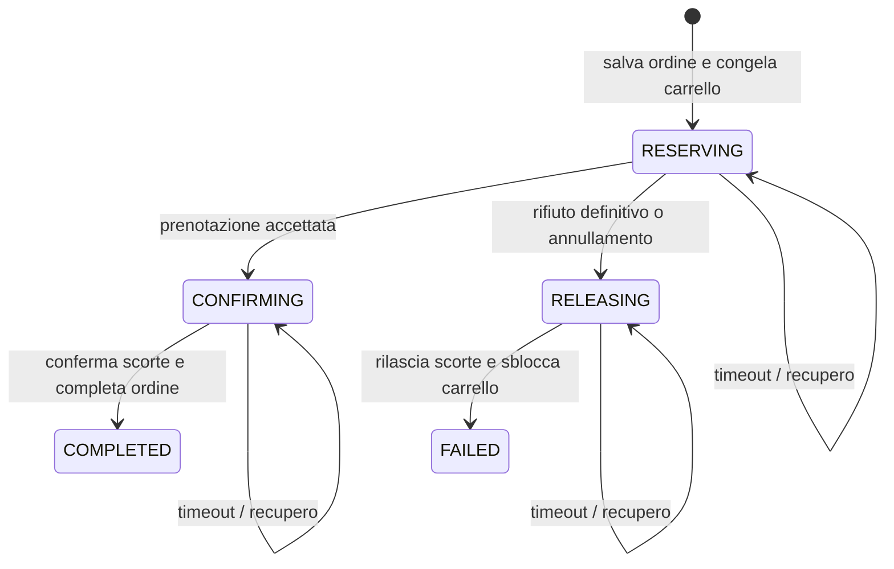

# Dal monolito al checkout distribuito

Nel monolito `OrderService.createOrder` legge utenti e prodotti tramite JPA e modifica scorte, ordine e carrello nella stessa transazione. Questa migrazione assegna a prodotti la gestione delle scorte e a ordini quella del checkout. Carrello e ordini rimangono nello stesso servizio per mantenere locale il loro coordinamento.

## Proprietà dei dati

- Utenti e indirizzi appartengono a `user-service`.
- Prodotti, scorte disponibili e prenotazioni appartengono a `product-service`.
- Carrelli, ordini e stato del checkout appartengono a `order-service`.

`userId` e `productId` sono riferimenti scalari, senza accesso ai database remoti né FK tra servizi. Le FK rimangono tra tabelle dello stesso database, per esempio ordine–righe e prenotazione–prodotti. Le API verificano l'esistenza quando necessario, ma non offrono un vincolo referenziale distribuito: la cancellazione utenti richiederà una politica di conservazione degli ordini. Gli ordini già creati conservano ID, nome e prezzo e restano consultabili senza interrogare utenti o catalogo.

Flyway gestisce separatamente lo schema di ogni servizio. `V2` nel servizio prodotti aggiunge le prenotazioni senza riscrivere la precedente migrazione. Questa modifica migra funzionalità e schemi; non copia dati da un'istanza del monolito. Un trasferimento di dati esistenti richiede un piano separato per preservare gli ID e coordinare il passaggio delle scritture.

## Checkout persistente

La combinazione `(user_id, idempotency_key)` identifica un tentativo. `checkout_id`, generato sul server, è l'identificativo globale delle operazioni verso prodotti. Riutilizzare una chiave recupera sempre l'ordine originario, anche se nel frattempo è cambiato il carrello.

Il primo commit locale salva un ordine `PENDING`, le righe con il prezzo del carrello e il collegamento al carrello congelato. Nessuna prenotazione remota parte prima di questo commit.

Ogni passo successivo ha una transazione locale separata. Una prenotazione accettata porta a `CONFIRMING`. La conferma delle scorte precede, nella fase successiva, lo svuotamento del carrello e il passaggio dell'ordine a `CONFIRMED`/`COMPLETED`, salvati insieme nel database ordini.

Un rifiuto definitivo della prenotazione porta a `RELEASING`. Dopo il rilascio, ordine `CANCELLED`/`FAILED` e sblocco del carrello vengono salvati insieme. Le righe del carrello vengono conservate. L'annullamento richiesto dal client è ammesso soltanto prima della fase `CONFIRMING`; dopo la decisione di confermare, il recupero deve completare quella decisione.

Non ci sono transazioni XA né rollback SQL attraverso HTTP. Un rilascio è una compensazione di business e deve poter essere ripetuto.

## Concorrenza e idempotenza

- Un lock sulla riga del carrello serializza aggiunte, rimozioni e avvio del checkout. Anche la prima creazione del carrello è protetta tramite `INSERT ... ON CONFLICT`.
- Un lock sulla riga dell'ordine serializza richieste concorrenti e worker di recupero, anche su più istanze. Ogni transazione mantiene questo lock durante una chiamata HTTP con timeout configurato. È un compromesso semplice per questo progetto: a volumi maggiori si potrà passare a worker con lease e coordinamento più articolato.
- Prodotti serializza ogni ID prenotazione tramite un advisory lock transazionale PostgreSQL. Questo protegge anche il primo inserimento, quando la riga non esiste ancora.
- I prodotti vengono bloccati in ordine crescente di ID. Verifica disponibilità, sottrazione e salvataggio della prenotazione sono atomici per tutto il carrello.
- Anche aggiornamento e disattivazione del catalogo bloccano la riga del prodotto. Le modifiche assolute alle scorte sono rifiutate durante una prenotazione attiva, per evitare che un successivo rilascio ricostruisca una quantità incoerente.
- Una prenotazione `RELEASED` è terminale; un rilascio anticipato crea un record che impedisce a prenotazioni tardive di applicarsi. Una prenotazione `CONFIRMED` non può più essere rilasciata.

Questi meccanismi non garantiscono la consegna di una sola richiesta HTTP: garantiscono che richieste ripetute non ripetano il medesimo effetto sulle scorte.

## Guasti e recupero

| Interruzione | Stato persistente | Azione al recupero |
| --- | --- | --- |
| Ordini si arresta prima di chiamare prodotti | `RESERVING` | Invia la prenotazione |
| Prodotti prenota ma la risposta si perde | `RESERVING` | Ripete la stessa prenotazione, senza altra sottrazione |
| Ordini si arresta dopo aver deciso la conferma | `CONFIRMING` | Conferma la prenotazione |
| Prodotti conferma ma il commit locale fallisce | `CONFIRMING` | Ripete la conferma e completa ordine e carrello localmente |
| Il rilascio non risponde | `RELEASING` | Ripete il rilascio, senza duplicare il ripristino |

Lo scheduler legge fino a 20 ordini recuperabili per ciclo. Gli errori HTTP rimandano il passo con attesa esponenziale da 2 fino a 60 secondi. Il numero di tentativi e la prossima esecuzione sono persistenti; i tempi del checkout sono `Instant` e colonne PostgreSQL con fuso orario. Il polling predefinito è ogni 5 secondi. Le operazioni continuano finché i servizi tornano disponibili; non esiste una scadenza automatica delle prenotazioni.

Non si libera una prenotazione soltanto perché è passato del tempo: un ordine potrebbe essere già impegnato a confermarla. Un checkout ancora `RESERVING` può essere annullato attraverso l'API, che registra prima la decisione di compensare. In `CONFIRMING` è necessario completare la conferma, non modificare manualmente le scorte.

Se un errore di database impedisce il commit, lo stato precedente rimane recuperabile e viene registrato un errore nei log. Errori permanenti di contratto o dati possono richiedere un intervento: non vengono trasformati automaticamente in un successo o in un rilascio non sicuro. Il recupero automatico è previsto mentre ordini è in esecuzione; spegnerlo ferma temporaneamente anche il coordinamento.

## Controllo operativo

Configurazione in `.env.example`:

- `USER_SERVICE_URL`, `PRODUCT_SERVICE_URL`: URL delle applicazioni, non dei database.
- `SERVICE_CONNECT_TIMEOUT=2s`, `SERVICE_READ_TIMEOUT=5s`: limiti delle chiamate HTTP.
- `CHECKOUT_RECOVERY_ENABLED=true`: abilita lo scheduler.
- `CHECKOUT_RECOVERY_DELAY=5000`: intervallo tra cicli in millisecondi.

Per un acquisto in attesa:

1. Consultare `GET /api/orders/{id}` con l'utente corretto: mostra `checkoutId`, `phase`, stato e motivo di un eventuale rifiuto.
2. Cercare il `checkoutId` nei log di ordini e controllare salute e connettività di prodotti.
3. Ripristinare la dipendenza e lasciare attivo il recupero. Il database prodotti conserva la prenotazione associata a quell'ID.
4. Se il cliente rinuncia ed è ancora possibile annullare, usare `/cancel`. Il carrello resta congelato fino al rilascio riuscito.

Non eliminare manualmente ordini in corso o record di prenotazione, e non modificare le scorte per simulare il rollback. I record sono necessari per riconoscere retry tardivi. La retention di chiavi e prenotazioni e un sistema di allarmi sono evoluzioni da progettare prima di un impiego operativo su larga scala.

## Riferimenti

- [Client HTTP di Spring](https://docs.spring.io/spring-framework/reference/integration/rest-clients.html)
- [Timeout del client HTTP JDK in Spring](https://docs.spring.io/spring-framework/docs/current/javadoc-api/org/springframework/http/client/JdkClientHttpRequestFactory.html)
- [Lock di PostgreSQL](https://www.postgresql.org/docs/18/explicit-locking.html)
